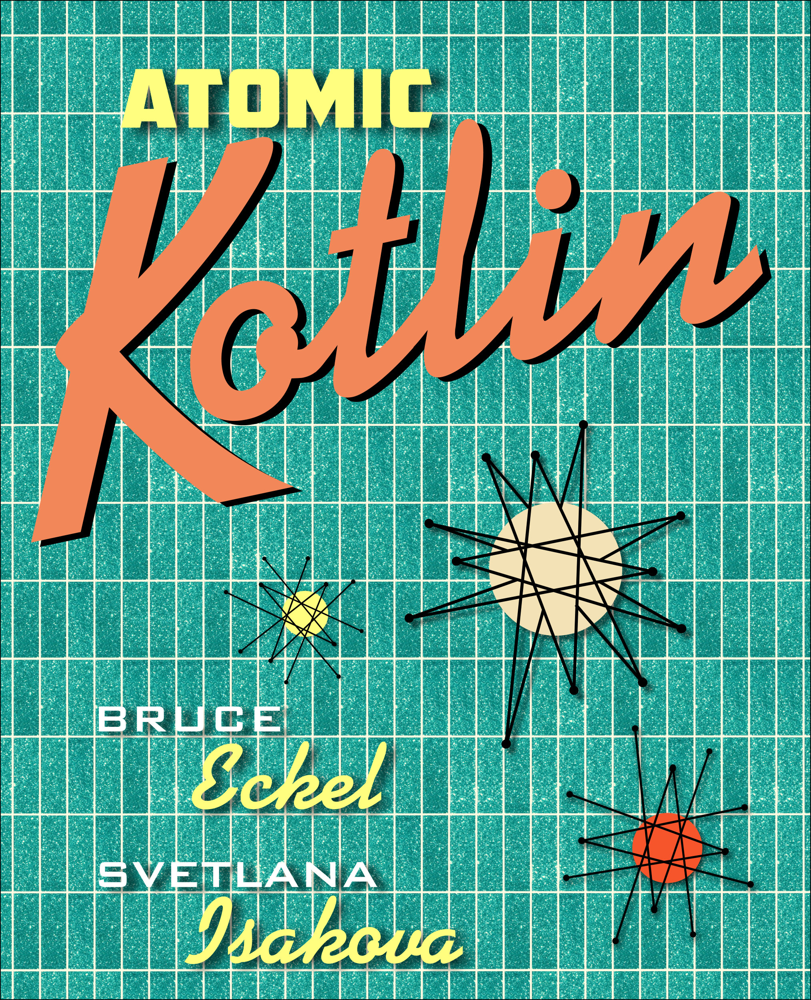

## www.OnJava8.com

{ width=40% }

---

## Examples From Upcoming

{ width=40% }

---

### TLDR: Fixes the Java Annoyances
* Gets rid of almost all remnants of bad Java design
* Anything the language can do for you
* But interacts/integrates easily with Java
* Runs on Java 6 JVM, official Android Language

---

### Enables Functional Programming
* Invariance by default
* First-class functions that are easy to manipulate
* Much more useful lambdas, without restrictions

---

### Top-Level Functions

{{Summary1/BasicFunctions.kt}}

---

### String templates

{{Summary1/StrTemplates.kt}}

---

### Triple Quotes

{{Summary1/ThreeQuotes.kt}}

---

### No Primitives!

{{Summary1/NumberTypes.kt}}

---

### Iteration

{{Summary1/IterateThroughString.kt}}

---

### Ranges

{{Summary1/IntRange.kt}}

* Plus more range support

---

### Named and Default Arguments

{{NamedAndDefaultArgs/NamedAndDefaultArgs.kt}}

---

### Lists are First-Class

{{Summary2/ListCollection.kt}}

---

### Classes

{{Summary2/ClassBodies.kt}}

---

### Data Classes

{{DataClasses/Simple.kt}}

---

### Prefer Extension Functions to Inheritance

{{Extensions/BookExtensions.kt}}

---

### Pattern Matching

{{WhenExpressions/WhenExpressions.kt}}

* Far greater complexity possible

---

### Local Functions

{{LocalFunctions/LocalExtensions.kt}}

---

### Null Safety

{{Nullable/Dereference.kt}}

---

### Nullable Types Require Explicit Checks

{{SafeCalls/SafeCall.kt}}

* Plus significant additional support

---

### Lambdas (1)

{{Lambdas/LambdaTypeInference.kt}}

---

### Lambdas (2)

{{Lambdas/FormatListWithLambda.kt}}

---

### Lambdas (3)

{{Lambdas/TwoArgLambda.kt}}

---

### Functional Operations

{{ListOperations/DisplayListMap.kt}}

---

### Operator Overloading

{{Operators/Num.kt}}

---

### Java Collection Invariance

```java
import java.util.*;

class Animal {}
class Cat extends Animal {}

public class Invariant {
  public static void main(String[] args) {
    List<Animal> animals = new ArrayList<Cat>();
    // error: incompatible types: ArrayList<Cat>
    // cannot be converted to List<Animal>
  }
}
```

* Because reasons
* ... which never quite make sense

---

### Automatic Covariance!

```kotlin
open class Animal
class Cat: Animal()

fun main(args: Array<String>) {
  val cats: List<Cat> = listOf(Cat(), Cat())
  val animals: List<Animal> = cats
}
```

---

### Liberation From Erasure!

```kotlin
inline fun <reified T: Any> type(c: T) =
  c::class.qualifiedName
```

---

### Many Other Powerful Features
* Simplified Generics
* Delegation
* Coroutines (Kotlin 1.1)
* And Much More
* Watch this space: AtomicKotlin.com
